<!-- jump_to_middle -->
<!-- alignment: center -->
<!-- font_size: 3 -->
`hckr.cc/jj-slides`
<!-- font_size: 1 -->
_the layout and font size are a little messed up, sorry about that!_

_"who is this guy?"_
---

<!-- column_layout: [1, 10, 1] -->
<!-- column: 1-->
<!-- incremental_lists: true -->
- Y4 CS
<!-- new_line -->
-  found out about `jj` ~1.5 years ago
    - looks pretty interesting/cool
    - tried it out
> _"wtf? what? how? i have no idea what's going on"_
<!-- new_line -->
-  someone (great guy 👍🏻) i know wrote a blog
    - `https://blog.chay.dev/basic-jj-workflows/` 
    - _more and more community guides are popping up_
<!-- new_line -->
- using `jj` for about ~2 months now
    - clearly **not** a expert 

_"why should i care about `jj`?"_
---

<!-- column_layout: [1, 10, 1] -->
<!-- column: 1-->
<!-- incremental_lists: true -->
1. version control is (objectively) **useful**
 
<!-- new_line -->
2.  `git` is not the only VCS in the world
    -  _e.g. `mercurial`, `sapling`_
<!-- new_line -->
3. a different set of semantics to think about version control
<!-- new_line -->
4. it is written in <span style='color: #F85208'>rust</span> /s
<!-- new_line -->
5. **most importantly, "why not?"**
    - <span style='color: #FF9110'>**hacker spirit** 🦆</span>

<!-- end_slide -->
<!-- jump_to_middle -->

convince you that `jj` is a viable alt to `git`
---

at a glance
---

<!-- speaker_note: |
    only git backend is production ready, internally at google, they have their own cloud backend

    having that option to use `git` even in `jj` repo gave me more confidence to try it out
-->

<!-- column_layout: [1, 10, 1] -->
<!-- column: 1-->
<!-- incremental_lists: true -->
- `jj` is the cli, "Jujutsu" is the name
<!-- new_line -->
- created by <span style='color: #906CCF'>Martin von Zweigbergk</span> @ Google
    - started out as his 20% project
    - now he works on it full time
> _pursue your passion projects! you never know where it will lead to_
<!-- new_line -->
- `git` compatible
<!-- new_line -->
- you can continue collaborating with everyone on git[hub/lab/bucket/ea]
    - _no one will know you are using `jj`_
<!-- new_line -->
- `jj` uses a regular `git` repo to store "data" (e.g. commits)
    - _supports different backends*_
<!-- new_line -->
-  you can still use `git` in a repo managed by `jj`

getting started
---

<!-- column_layout: [2, 10, 2] -->
<!-- column: 1-->
# Installation
ref: `https://jj-vcs.github.io/jj/latest/install-and-setup/`

## Mac via Homebrew:

```bash
brew install jj
```

## Linux / Windows via `cargo`:

```bash
# Linux
cargo install --locked --bin jj jj-cli

# Windows
cargo install --locked --bin jj jj-cli --features vendored-openssl
```

<!-- speaker_note: |
    highly recommend setting up command line completion
-->

# Configuration

setting user-level (global) name and email for your commits


```bash
jj config set --user user.name "<your name>"
jj config set --user user.email "<your email>"
```

> [!note]
>_remove `--user` to set repo-level config (run the config at the root of the repo)_


get the path to config file:

```bash +exec
jj config path --user
```

edit the global config file (defaults to `~/.jjconfig.toml`):

```bash
jj config edit --user
```

baby steps
---
<!-- column_layout: [1, 10, 1] -->
<!-- column: 1-->
# Initializing a new repo

```fish +exec
# `--colocate`: creates repo that interop with both `jj` and `git`
jj git init test-repo --colocate
```
<!-- pause -->
you should see both `.jj` and `.git` directories in the target directory

```fish +exec
ls -lah test-repo
```

<!-- pause -->
---

let's take a look how `jj`'s **_revision_** history compares to `git`'s **_commit_** history:

<!-- column_layout: [1, 1] -->
<!-- column: 0-->

```fish +exec
/// cd test-repo
jj log
```

<!-- column: 1-->
```fish +exec
/// cd test-repo
git log
```
<!-- speaker_note: |
    - Talk about how `git` creates a default branch named `main` by default but in `jj`, theres no default branch
    - `jj` has a root commit but `git` does not
-->

working copy
---

<!-- column_layout: [1, 10, 1] -->
<!-- column: 1-->
<!-- alignment: center -->
_"the place where files are read from in order to create a commit"_

---

<!-- speaker_note: |
    - Would be good to talk about how `git`'s working copy works, along with the staging area and the 3 step process of creating a commit before talking about `jj`'s working copy
-->

<!-- alignment: left -->
<!-- incremental_lists: true -->

1. `jj` **automatically*** adds changes from the working copy to the commit
<!-- speaker_note: |
    - `jj` actually snapshots the changes when a command like is ran but it is an important detail for now
-->
<!-- new_line -->
2. "working copy commit" - represented by the `@` symbol

```log
@  yuvlmvtu yihong@nushackers.org 2025-04-11 17:13:56 fa815c28
│  (empty) (no description set)
◆  zzzzzzzz root() 00000000
```
-  `(empty)` - the revision/commit is empty (no changes)
- `(no description set)` - no commit message
<!-- new_line -->
3. **no** staging area
<!-- column_layout: [1,1] -->
<!-- column: 0-->
<!-- alignment: center -->
`git`
```fish
touch hello.txt;
git add hello.txt

# Make some changes to hello.txt
git add hello.txt
```

<!-- column: 1-->
<!-- alignment: center -->
`jj`
```fish
touch hello.txt

# Make some changes to hello.txt

# The changes are automatically* 
# added to the working copy commit
```

creating and editing a change 
---

<!-- speaker_note: |
    At this point, they would already know how to create a commit with `git`
-->

<!-- column_layout: [1, 10, 1] -->
<!-- column: 1-->

<!-- alignment: center -->
There is already an **empty change** created when we initialize the repo. 

_Therefore, we can simply just make the intended edits and it will be added automatically to the working copy commit._

---

<!-- alignment: left -->
# Creating a new (empty) revision 

```fish
# creates a new revision on top of `@`
jj new 

# creates a new revision on top of >= 1 parents 
jj new <id-1> <id-2> ...
```

# Editing a previous revision 

_there are 2 ways to do it, each with its own pros and cons:_

## Create a new change and move/add it into a previous revision 

```fish
jj new 

# move changes from `@` to revision specified by <id>
jj squash --into <id>
```

## Directly editing the previous change 

```fish
jj edit -r <id>

# now `@` is the revision specified by <id>
```
change id vs commit id
---

<!-- column_layout: [1, 10, 1] -->
<!-- column: 1-->

<!-- alignment: center -->

`<id-N>` (in 99.9% of cases) refer to change IDs

<!-- pause -->
---

<!-- alignment: center -->
"A change is a commit that evolves around time"

```mermaid +render
graph TD
    ChangeID["🔒 Change ID: bnVzaGFja2Vycwo"]:::change_id --> Commit2["Commit 2 (Visible)"]
    Commit2 --> Commit1["Commit 1 (Hidden)"]

    classDef change_id fill:#ffeb3b,stroke:#fbc02d,stroke-width:2px,color:#000,font-weight:bold;
    classDef visible fill:#e6f3ff,stroke:#4a90e2,stroke-width:1px,color:#000;
    classDef hidden fill:#f0f0f0,stroke:#ccc,stroke-width:1px,color:#666;

    class ChangeID change_id;
    class Commit2 visible;
    class Commit1 hidden;
```



<!-- alignment: left -->
- Change ID **remains the same**
<!-- new_line -->
- Every new edit (aka a new snapshot) to the working copy (aka a new snapshot) **creates a new commit (with a new ID)**

deciphering `jj log`
---

<!-- column_layout: [1, 10, 1] -->
<!-- column: 1-->

<!-- new_lines: 10 -->
```
@  yuvlmvtu yihong@nushackers.org 2025-04-11 17:13:56 fa815c28
│  (empty) (no description set)
◆  zzzzzzzz root() 00000000
```

<!-- alignment: center -->
| <span style="color:#4A90E2">**yuvlmvtu**</span> | <span style="color:#40A02B">**yihong@nushackers.org**</span> | <span style="color:#F5A623">**2025-04-11 17:13:56**</span> | <span style="color:#9013FE">**fa815c28**</span> |
| --- | --- | --- | --- |
| **Change ID** | Author Email | Commit Time | **Commit ID** |

evolving a commit
---

<!-- column_layout: [1, 10, 1] -->
<!-- column: 1-->

<!-- alignment: center -->
_for each `jj log` command, take note of the commit and change IDs_

---

<!-- column_layout: [1, 1] -->

<!-- column: 0-->

```fish +exec
/// cd test-repo
touch hello.txt
/// ls -lah
```
<!-- pause -->
```fish +exec
/// cd test-repo
jj log
```

<!-- column: 1-->

<!-- pause -->

```fish +exec
/// cd test-repo
touch world.txt
/// ls -lah
```
<!-- pause -->

```fish +exec
/// cd test-repo
jj log
```

inspecting the change
---

<!-- column_layout: [1, 10, 1] -->
<!-- column: 1-->

<!-- alignment: center -->
_"looking at how a change has evolved over time"_

```fish +exec
/// cd test-repo
jj evolog
```

```fish +exec
/// cd test-repo
# Inspect the patches between the commits in the change
jj evolog -p
```

> [!Note]
> You can also "branch off" a (hidden) commit 😱

<!-- speaker_note: |
    Can talk about the different options to show a summary etc.
-->

inspecting repo status
---

<!-- column_layout: [1, 10, 1] -->
<!-- column: 1-->

## High-level overview/summary

```fish
# shorthand: jj st
jj status
```

## Inspect file content changes 

```fish
# inspect file changes from parent revision (`@-`) to working copy commit (`@`)
jj diff

# to compare between different revisions
jj diff --from old --to new
```

writing a description/commit message
---

<!-- column_layout: [1, 10, 1] -->
<!-- column: 1-->

<!-- alignment: center -->
"giving meaning to a change"

<!-- pause -->
---

<!-- alignment: left -->
# 30s personal rant

help your future self and others out by writing **good** descriptions/commit messages

> [!warning]
> bad commit messages: 'fix', 'works now', 'oops', 'yay new button'

`https://conventionalcommits.org`

a better description:

> feat: allow provided config object to extend other configs

by prefixing the type, one can easily filter the history based on the type of change (e.g. `feat`, `fix`, `chore`, etc.)

<!-- pause -->

_you are also encouraged to add more context below the title message either in the form of bullet points or in prose_

writing a description/commit message
---

<!-- column_layout: [1, 10, 1] -->
<!-- column: 1-->

<!-- alignment: center -->
"giving meaning to a change"

---
`jj` allows **empty** and **description-less** changes

<!-- pause -->
---

<!-- alignment: left -->

## Writing a description for the working copy commit

```fish
# shorthand: `jj desc`
jj describe 
```

## Write/Edit a description for a specific change

```fish
# `@-` refers to the immediate parent of the working copy commit
jj desc -r @-
```

> [!Note]
> jj supports a language (revset) for selecting changes/revisions (https://jj-vcs.github.io/jj/latest/revsets/)

---

- You can edit/change the description of a change/revision **at any time**
<!-- new_line -->
- With this flexibility, you now have the freedom to develop **new workflows**!

<!-- speaker_note: |
    Show how `git` is able to     

    Show a demo of how this works - create a bunch of a new description-less changes and then use `jj desc` to add a description to previous changes

    Talk about a new workflow that this flexibility gives
-->

workflows
---

<!-- column_layout: [1, 10, 1] -->
<!-- column: 1-->

# Describe-First

<!-- pause -->
> for every change i intend to make, let me write the description first and then make the change

<!-- pause -->
```fish
jj new

jj desc

# make the change

# repeat for every subsequent change
```

<!-- pause -->

# Edit-First

<!-- pause -->
> for every change i intend to make, let me make the change first and then write the description

<!-- pause -->
**This is the default workflow many adopt when using `git`**

<!-- pause -->
```fish
jj new

# make the change

jj desc

# repeat for every subsequent change
```

<!-- pause -->
# Do-Everything-First-Split-Into-Commits-Later

<!-- pause -->

> i have a feature, let me implement the entire feature and then split it into commits/multiple smaller changes

<!-- pause -->

is this possible with `jj`? remember that `jj` automatically adds changes to the working copy commit 🤔

<!-- pause -->
```fish
jj new

# cook up the entire feature

# okay, now what?
```

splitting revisions
---

<!-- column_layout: [1, 10, 1] -->
<!-- column: 1-->

<!-- alignment: center -->

recall that we do **not** have a staging area

<!-- pause -->

_therefore, we need to a way to break the working copy commit into multiple smaller changes_

<!-- pause -->
---

<!-- alignment: left -->
# Split a revision into 2

```fish
# split the working copy commit into 2 smaller changes
jj split

# split a specific revision
jj split -r <revset>
```

<!-- pause -->
_`jj` comes with a **builtin diff editor** that you can use to choose the changes you want to split_

<!-- pause -->
> [!Note]
> After you split a revision, you stay on **parent** revision

<!-- pause -->
## A tweeny weeny gotcha 🙈

<!-- pause -->
try inspecting the "time" of the commit using `jj log` and `git log`:
<!-- pause -->

<!-- column_layout: [1, 1] -->

<!-- column: 0-->

<!-- alignment: center -->
`jj log`

```
○  yuvlmvtu yihong@nushackers.org 2025-04-12 18:37:15 c02867c9
│  (no description set)
◆  zzzzzzzz root() 00000000
```

<!-- column: 1-->

`git log`

```
commit c02867c9036e91432deff2a34a6b9cc2c7aceb10
Author: Shen Yi Hong <yihong@nushackers.org>
Date:   Fri Apr 11 17:13:56 2025 +0800
```
<!-- pause -->
<!-- column_layout: [1, 1] -->

<!-- column: 0-->

**Commit Time**

_"last modified timestamp of the commit"_

<!-- speaker_note: recall that commits are evolving -->

<!-- column: 1-->

**Author Time**

_"when the commit was created"_

<!-- reset_layout -->

```fish
# Reset the author time to the current timestamp
jj desc -r <revset> --reset-author --no-edit
```

bookmarks
---

<!-- column_layout: [1, 10, 1] -->
<!-- column: 1-->

<!-- alignment: center -->
named pointers to revisions (conceptually similar to `git` branches)

<!-- pause -->

however, this is **no** concept of an active bookmark (branch) in `jj`

<!-- pause -->
---

<!-- alignment: left -->

## Creating a bookmark

equivalent to creating a local branch in `git` semantics

```fish
# add a bookmark to the current working copy commit
jj bookmark create <name>

# add a bookmark to a specific revision
jj bookmark create -r <revset> <name>
```

<!-- pause -->
## Listing bookmarks

```fish
jj bookmark list
```

<!-- pause -->
## Updating a bookmark

when you make a new change, the bookmark will **not automatically update to point to the new change**

```fish
# if `-r` is not specified, it defaults to the working copy commit
jj bookmark set -r <revset> <bookmark-name>
```

conflicts
---

<!-- column_layout: [1, 10, 1] -->
<!-- column: 1-->

<!-- alignment: center -->
_"different changes are made to the same part of a file"_

---

<!-- alignment: left -->
<!-- incremental_lists: true -->
- `jj` can record conflicts in commits (first-class conflicts)
<!-- new_line -->
- you do **NOT** need to resolve conflicts with `jj` if you don't want to
<!-- new_line -->
- conflict resolution can be delayed
<!-- new_line -->
- a whole bunch of other advantages with first-class conflicts: `https://jj-vcs.github.io/jj/latest/conflicts/`
<!-- new_line -->

> _"okay this sounds good, how does it actually look like?"_

<!-- pause -->
<!-- new_lines: 3 -->

## Resolving conflicts

```fish
# brings up the builtin diff editor
jj resolve
```

operation log
---

<!-- column_layout: [1, 10, 1] -->
<!-- column: 1-->

<!-- alignment: center -->

a log of all operations that modified the repo

<!-- pause -->

_this is different from the `jj log` which shows the log of changes/revisions_

<!-- pause -->

---

<!-- alignment: left -->

## Viewing the operation log

```fish
jj op log
```

<!-- pause -->

they seemed to be stored as files under: `.jj/repo/op_store/operations`

<!-- pause -->
## Undo an operation

> this is one of my favorite features ❤️

<!-- pause -->

```fish
# undo the last operation
jj undo
```

`git` remotes
---

<!-- column_layout: [1, 10, 1] -->
<!-- column: 1-->

<!-- alignment: center -->

_collaborating with others and storing your work on the ☁️_

<!-- pause -->
---

<!-- alignment: left -->
# Adding a remote

```fish
jj git remote add <name> <url>
```
<!-- pause -->
# Listing all remotes

```fish
jj git remote list
```

<!-- pause -->
# Pushing to remote

```fish
# if no remote is specified, it defaults to "origin"
jj git push --remote <name>
```

`git` remotes
---

<!-- column_layout: [1, 10, 1] -->
<!-- column: 1-->
<!-- pause -->
# Fetching from remote

```fish
# if no remote is specified, it defaults to "origin"
# if no branch is specified, it defaults to fetching all branches
jj git fetch --remote <name> --branch <branch-name>
```
<!-- pause -->
# Tracking a remote branch

```fish
jj bookmark track <branch-name>@<remote-name>
```
<!-- incremental_lists: true -->
- once you have tracked a remote branch, it becomes a **tracked remote bookmark**
<!-- new_line -->
- **tracked remote bookmarks** are associated with local bookmarks with the same name

final thoughts
---

<!-- column_layout: [1, 10, 1] -->
<!-- column: 1-->

<!-- incremental_lists: true -->

- (as of 17/04/2025) does **not** support:
    - `git` submodules
    - `git-lfs`: large file support

<!-- new_line -->

- things are brewing: `https://jj-vcs.github.io/jj/latest/roadmap/`

<!-- new_line -->

- i am **excited** about and want to use more of:
    - `jj run`: _"run a command across a set of revisions"_
    - `jj fix`: _"update files with formatting fixes or other changes"_

<!-- new_line -->

- `jj --help` to explore more commands to try out!


helpful links
---

<!-- column_layout: [1, 10, 1] -->
<!-- column: 1-->
<!-- incremental_lists: true -->

- `https://jj-vcs.github.io/jj/latest/`
<!-- new_line -->
- Martin's talk at GitMerge 2024: `https://www.youtube.com/watch?v=LV0JzI8IcCY`
<!-- new_line -->
- `https://blog.chay.dev/basic-jj-workflows/`
<!-- new_line -->
- `https://steveklabnik.github.io/jujutsu-tutorial/`
<!-- new_line -->
- Official Jujutsu discord: `https://discord.gg/dkmfj3aGQN`

<!-- end_slide -->
<!-- jump_to_middle -->

thank you!
---
